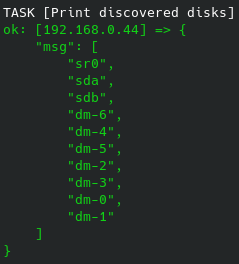
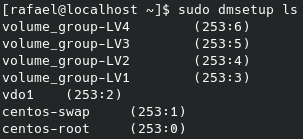

# Discovering Devices on Linux with Ansible

The playbook present in this project makes use of ansible_facts to collect raw information about devices on the managed node. Through a loop (using dict2items to transform a dictionary into a list of items suitable for looping) we fetch the 'key' to show only the device name.

  

* sd: SATA/SCSI/USB disk
* sr: Linux recognizes most optical storage (CD/DVD) as SCSI devices /dev/sr0, /dev/sr1 and so on.
* dm: Device Mapper. The kernel doesn't need to know how to deal directly with all forms of storage solutions, it just talks to a abstraction layer, the Device Mapper. Device Mapper provides an interface for the kernel to interact with block devices it knows about. Logical volumes in LVM are examples of mapped devices.

You can list the device names of mapped devices with the `dmsetup ls` command.

  

In this example, the device mappers are LVM and VDO (Virtual Data Optimizer) logical volumes.

The OS used on this lab was CentOS 7.